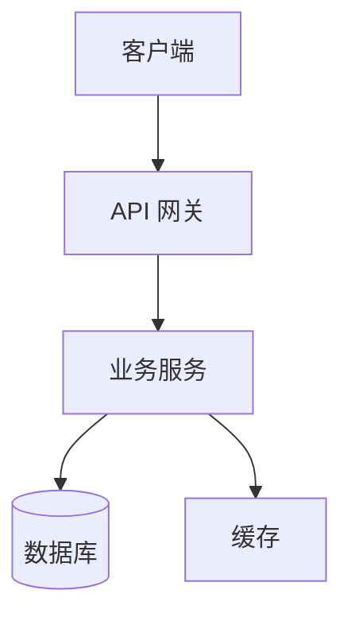
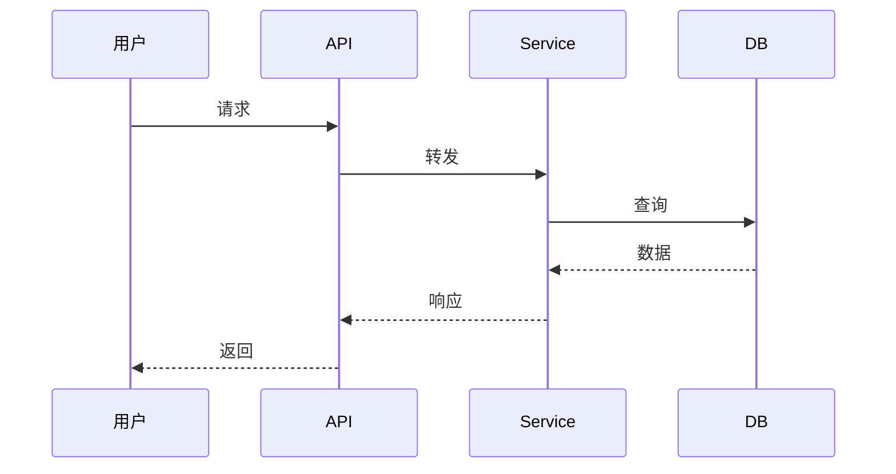
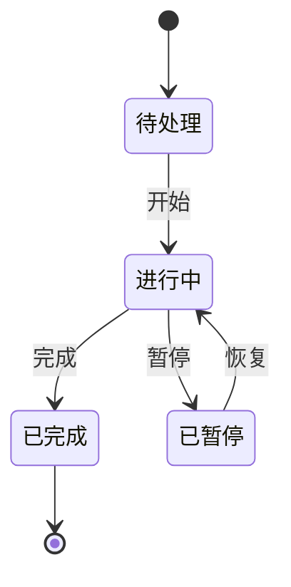

# 技术设计方案：{{change_name}}

## 一、方案概述

### 1.1 基本信息

| 项目 | 内容 |
|------|------|
| 变更名称 | {{change_name}} |
| 变更类型 | {{change_type}} |
| 设计版本 | {{design_version:V1.0}} |
| 设计人 | {{designer}} |
| 设计日期 | {{design_date}} |
| 方案状态 | {{status:初稿/评审中/已批准}} |
| PRD 引用 | [{{prd_ref}}]({{prd_ref}}) |

### 1.2 Intent Lock

> **意图锁定**：一句话锁定本次变更核心意图，Build 阶段会校验实现是否偏离此意图。

{{intent_lock}}

### 1.3 方案简介

{{design_summary}}

### 1.4 变更范围

**范围内**

{{in_scope}}

**范围外**

{{out_scope}}

## 二、需求追溯

> 本章节建立 PRD 功能需求（FR）与本设计文档的反向追溯关系，确保每个 FR 都有对应的技术实现。

### 2.1 FR 追溯矩阵

| FR 编号 | FR 名称 | 优先级 | 设计章节 | specs 路径 | 验收状态 |
|---------|---------|--------|----------|------------|----------|
| FR-001 | {{fr_name}} | {{fr_priority:P0/P1/P2}} | [§4.2 接口设计](#42-接口设计) | `specs/{{capability}}/spec.md` | {{fr_status:已覆盖/部分覆盖/未覆盖}} |

### 2.2 非功能需求追溯

| NFR 维度 | PRD 指标 | 设计章节 | 达标路径 |
|----------|----------|----------|----------|
| 性能 | {{perf_metric}} | [§五、性能设计](#五性能设计) | {{perf_path}} |
| 安全 | {{security_metric}} | [§六、安全设计](#六安全设计) | {{security_path}} |
| 可用性 | {{availability_metric}} | [§七、可靠性设计](#七可靠性设计) | {{availability_path}} |
| 可维护性 | {{maintainability_metric}} | [§八、兼容性与扩展性](#八兼容性与扩展性) | {{maintainability_path}} |
| 兼容性 | {{compatibility_metric}} | [§八、兼容性与扩展性](#八兼容性与扩展性) | {{compatibility_path}} |

### 2.3 验收标准覆盖

| PRD 验收标准（Given-When-Then） | 对应测试用例 | 设计实现位置 |
|--------------------------------|-------------|-------------|
| {{acceptance_criteria}} | {{test_case_id}} | {{implementation_location}} |

## 三、总体架构设计

### 3.1 架构原则

{{architecture_principles}}

> 列出遵循的架构原则（如：单一职责、开闭原则、依赖倒置、关注点分离等），并说明本方案如何体现。

### 3.2 系统架构图

{{system_architecture}}

> 建议使用 Mermaid 或 PlantUML 绘制，展示系统组件、外部依赖、数据流方向。

### 3.3 模块划分

| 模块名 | 职责 | 对外接口 | 依赖模块 |
|--------|------|----------|----------|
| {{module_name}} | {{module_responsibility}} | {{module_api}} | {{module_dependencies}} |

### 3.4 技术选型

| 层次 | 选型 | 版本 | 选型理由 |
|------|------|------|----------|
| 前端 | {{frontend_tech}} | {{frontend_version}} | {{frontend_reason}} |
| 后端 | {{backend_tech}} | {{backend_version}} | {{backend_reason}} |
| 存储 | {{storage_tech}} | {{storage_version}} | {{storage_reason}} |
| 中间件 | {{middleware_tech}} | {{middleware_version}} | {{middleware_reason}} |

## 四、详细设计

### 4.1 核心流程设计

{{main_flow}}

> 使用时序图或流程图描述核心业务流程。

### 4.2 接口设计

#### 接口 1：{{api_name}}

- **方法**：{{http_method}}
- **路径**：`{{api_path}}`
- **请求参数**：

| 参数名 | 类型 | 必填 | 说明 |
|--------|------|------|------|
| {{param_name}} | {{param_type}} | {{param_required}} | {{param_desc}} |

- **响应**：

| 字段 | 类型 | 说明 |
|------|------|------|
| {{field_name}} | {{field_type}} | {{field_desc}} |

- **错误码**：

| 错误码 | 含义 | 处理建议 |
|--------|------|----------|
| {{error_code}} | {{error_desc}} | {{error_handling}} |

### 4.3 数据模型设计

#### 实体：{{entity_name}}

| 字段 | 类型 | 约束 | 索引 | 说明 |
|------|------|------|------|------|
| {{field}} | {{type}} | {{constraint}} | {{index}} | {{comment}} |

#### 实体关系

{{entity_relationships}}

> 使用 ER 图描述实体间关系。

### 4.4 状态设计

> 若涉及状态机或流程编排，在此定义状态转换。

| 当前状态 | 触发事件 | 目标状态 | 动作 |
|----------|----------|----------|------|
| {{current_state}} | {{event}} | {{target_state}} | {{action}} |

## 五、性能设计

### 5.1 性能目标

| 指标 | PRD 要求 | 设计目标 | 余量 |
|------|----------|----------|------|
| 响应时间 | {{prd_response_time}} | {{design_response_time}} | {{response_margin}} |
| 吞吐量 | {{prd_throughput}} | {{design_throughput}} | {{throughput_margin}} |
| 并发数 | {{prd_concurrency}} | {{design_concurrency}} | {{concurrency_margin}} |

### 5.2 性能优化策略

{{performance_optimization}}

### 5.3 缓存设计

| 缓存层 | 缓存内容 | 失效策略 | 容量预估 |
|--------|----------|----------|----------|
| {{cache_layer}} | {{cache_content}} | {{cache_strategy}} | {{cache_size}} |

## 六、安全设计

### 6.1 安全需求分析

{{security_analysis}}

### 6.2 认证与授权

{{auth_design}}

> 说明认证方式（JWT/OAuth2/SSO）、授权模型（RBAC/ABAC）、权限粒度。

### 6.3 数据安全

| 数据类型 | 加密方式 | 存储位置 | 访问控制 |
|----------|----------|----------|----------|
| {{data_type}} | {{encryption}} | {{storage}} | {{access_control}} |

### 6.4 安全审计

{{security_audit}}

> 审计日志格式、留存周期、合规要求。

## 七、可靠性设计

### 7.1 容错设计

{{fault_tolerance}}

### 7.2 降级与熔断

| 场景 | 触发条件 | 降级策略 | 恢复条件 |
|------|----------|----------|----------|
| {{scenario}} | {{trigger_condition}} | {{degradation_strategy}} | {{recovery_condition}} |

### 7.3 监控告警

| 监控项 | 阈值 | 告警级别 | 处理动作 |
|--------|------|----------|----------|
| {{metric}} | {{threshold}} | {{alert_level}} | {{action}} |

## 八、兼容性与扩展性

### 8.1 兼容性设计

- **API 向后兼容**：{{api_compatibility}}
- **数据迁移**：{{data_migration}}
- **版本共存**：{{version_coexistence}}

### 8.2 扩展性设计

- **水平扩展**：{{horizontal_scaling}}
- **垂直扩展**：{{vertical_scaling}}
- **功能扩展点**：{{extension_points}}

## 九、测试策略

### 9.1 测试范围

| 测试类型 | 覆盖范围 | 覆盖率目标 |
|----------|----------|------------|
| 单元测试 | {{unit_scope}} | {{unit_coverage:≥80%}} |
| 集成测试 | {{integration_scope}} | {{integration_coverage}} |
| 端到端测试 | {{e2e_scope}} | {{e2e_coverage}} |
| 性能测试 | {{perf_scope}} | {{perf_criteria}} |

### 9.2 测试用例设计

> 每个 PRD 验收标准至少对应 1 个测试用例，采用 Given-When-Then 格式。

### 9.3 Mock 策略

{{mock_strategy}}

## 十、部署方案

### 10.1 部署架构

{{deployment}}

### 10.2 配置管理

| 配置项 | 环境变量 | 默认值 | 说明 |
|--------|----------|--------|------|
| {{config_name}} | {{env_var}} | {{default_value}} | {{config_desc}} |

### 10.3 发布策略

- **发布方式**：{{release_strategy:蓝绿/灰度/滚动}}
- **回滚策略**：{{rollback_strategy}}
- **发布窗口**：{{release_window}}

## 十一、决策记录

> 关键技术决策及其备选方案，HandoffManager 会提取此章节作为 Build 阶段的上下文。

### 11.1 关键决策

| 决策编号 | 决策内容 | 备选方案 | 选择理由 | 影响范围 |
|----------|----------|----------|----------|----------|
| D-001 | {{decision}} | {{alternatives}} | {{reason}} | {{impact}} |

### 11.2 决策详述

#### D-001：{{decision_title}}

- **背景**：{{decision_background}}
- **选项**：
  - A. {{option_a}}
  - B. {{option_b}}
- **选择**：{{chosen_option}}
- **理由**：{{rationale}}

## 十二、约束

> 技术约束与限制条件，HandoffManager 会提取此章节作为 Build 阶段的上下文。

### 12.1 技术约束

{{technical_constraints}}

### 12.2 业务约束

{{business_constraints}}

## 十三、风险评估

### 13.1 技术风险

| 风险编号 | 风险描述 | 影响 | 概率 | 应对策略 |
|----------|----------|------|------|----------|
| TR-001 | {{risk_desc}} | {{impact:高/中/低}} | {{probability:高/中/低}} | {{mitigation}} |

### 13.2 实施风险

| 风险编号 | 风险描述 | 影响 | 概率 | 应对策略 |
|----------|----------|------|------|----------|
| IR-001 | {{risk_desc}} | {{impact:高/中/低}} | {{probability:高/中/低}} | {{mitigation}} |

## 十四、附录

### 14.1 参考文档

- [PRD]({{prd_ref}})
- {{reference_1}}

### 14.2 术语定义

| 术语 | 含义 |
|------|------|
| {{term}} | {{definition}} |

### 14.3 变更历史

| 版本 | 日期 | 修订人 | 修订内容 |
|------|------|--------|----------|
| V1.0 | {{design_date}} | {{designer}} | 初始版本 |
